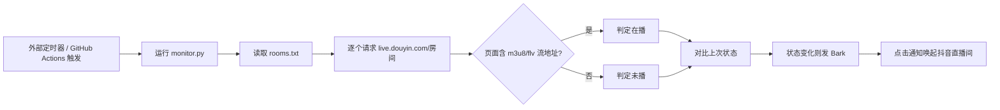

# 抖音直播间开播监控

自动监控一批抖音直播间，一旦开播 / 下播就通过 Bark 推送到 iPhone。点击通知可直接用 `aweme://` Scheme 唤起抖音进入对应直播间。

## 工作原理



判定依据：抖音网页 SSR 的 `liveStatus` 字段对正在直播的房间也返回 `normal`（不可信），但离线房间页面里 `m3u8/flv/pull_url` 等真实流地址计数为 0，直播房间则大量存在。因此以「页面含真实流地址」作为在播的可靠信号；页面取不到或异常则本次不通知（防误报）。

## 文件说明

- `monitor.py` —— 主程序：读取 rooms.txt、判定开播、发 Bark、写 state.json。
- `rooms.txt` —— 监控列表，只改这个文件即可，无需碰 monitor.py。
- `state.json` —— 运行时状态（上次开播状态），由程序自动维护，已加入 .gitignore。
- `add_room.ps1` —— 脱离本工具、在本地命令行加房间的脚本（见下文）。
- `add_room.py` —— 同上功能的 Python 版（备用）。
- `.github/workflows/douyin-monitor.yml` —— GitHub Actions 工作流（原生 schedule 作为备胎）。

## rooms.txt 格式

每行一个房间，逗号分隔「链接或标识, 显示名」：

    https://live.douyin.com/125093611494, 子成老师讲家庭教育
    https://v.douyin.com/1_AyxhJoFkc/, 羽川电商

- 显示名可省略（短链会自动用 sec_uid 反查昵称）。
- 支持：
  - 纯数字房间号 / 抖音号（用户名）
  - `live.douyin.com/房间号`
  - `v.douyin.com/xxxx` 分享短链（自动跟重定向拿 room_id 或 sec_uid，已修复此前不生效的问题）
  - `www.douyin.com/user/xxx` 主页链接
- `#` 开头为注释，空行忽略。
- 修改后需提交到仓库，CI 才能读到。

## 如何添加直播间

**方式 A：直接编辑 rooms.txt（推荐）**
1. 在 `rooms.txt` 末尾加一行 `链接, 名字`。
2. 提交并推送到 `main` 分支，工作流自动重新加载。

**方式 B：用 add_room.ps1（脱离本工具，本地命令行）**
1. 准备一个 GitHub 令牌（Personal access token，含 `repo` 权限），设为环境变量（一次即可，之后不用重复）：
   `setx GH_TOKEN 你的令牌`
2. 运行：
   `powershell -ExecutionPolicy Bypass -File add_room.ps1 "直播间链接" "显示名"`
   脚本会读取 rooms.txt、追加一行、提交并触发工作流。脚本已加入 .gitignore，不会上传泄露令牌。

## 通知（Bark）

- 监控到开播 / 下播时，向 Bark 推送标题 `HH:MM开播` / `HH:MM下播`，正文为直播间名。
- 点击通知会用 iOS 的 `aweme://live?room_id=...` Scheme 直接唤起抖音进入对应直播间；拿不到 room_id 时回退到 `https://live.douyin.com/房间号` 网页链接。
- 安卓端可把 `aweme` 换成 `snssdk1128`。
- Bark 的 key 通过仓库 Secrets（`BARK_KEY`）注入，不在代码里硬编码。

## 调度

监控由定时器反复触发，确保全天覆盖（弥补 GitHub Actions 原生 schedule 白天可能被节流的问题）：

- **主调度**：外部定时器（如 cron-job.org）按较高频率触发仓库的 `workflow_dispatch`。当前采用「四时段、全天 97 次、全部避开整点」方案（北京时间 Asia/Shanghai），共 16 条 Crontab（每条 = 1 个 job）：

  ```
  # 【时段1】06:32–08:27 每5分 24次
  32,37,42,47,52,57 06 * * *
  02,07,12,17,22,27,32,37,42,47,52,57 07 * * *
  02,07,12,17,22,27 08 * * *

  # 【时段2】08:32–17:42 每25分 23次
  32,57 08 * * *
  22,47 09,14 * * *
  12,37 10,15 * * *
  02,27,52 11,16 * * *
  17,42 12,17 * * *
  07,32,57 13 * * *

  # 【时段3】18:02–19:57 每5分 24次
  02,07,12,17,22,27,32,37,42,47,52,57 18,19 * * *

  # 【时段4】20:02–次日06:27 每25分 26次
  02,27,52 20,01 * * *
  17,42 21,02 * * *
  07,32,57 22,03 * * *
  22,47 23,04 * * *
  12,37 00,05 * * *
  02,27 06 * * *
  ```

  触发方式：POST 仓库 `workflow_dispatch`，请求体 `{"ref":"main"}`，带令牌。
- **备胎**：GitHub Actions 原生 `schedule`（例如 `2-57/5 1-13` 对应北京时间 09:00–21:00），在外部定时器异常时兜底。注意原生 schedule 为 best-effort，白天可能延迟或不触发，故以外部定时器为主。

## 故障排查

- **某房间一直「无法识别的源 / 状态获取失败」**：URL 可能已失效或短链重定向异常。可临时换成 `live.douyin.com/房间号` 直链验证。
- **从不推送开播**：检查 Bark key（Secrets `BARK_KEY`）是否正确；本地直接跑 `python monitor.py` 看日志，`[bark skipped]` 表示未配置 key。
- **页面被 WAF 拦截（<50000 字符短页面）**：代码判为「无法判定」跳过，不误报；一般重试即可恢复。
- **v.douyin.com 短链不生效**：已修复——现自动跟重定向，从跳转结果中拿 room_id 或 sec_uid（兼容 `sec_uid=` 查询参数与 `share/user/`、`douyin.com/user/` 路径两种形式），不再只认 `sec_uid=` 查询参数；并优先在用户开播时解析出真实数字房号用于监控。

## 备注

- 本工具仅做开播 / 下播状态监测与通知，不录制、不转发直播内容。
- 抖音网页结构可能变动，若某天全部房间突然「无法判定」，通常是页面结构或风控变化，需更新 `monitor.py` 的判定逻辑。
